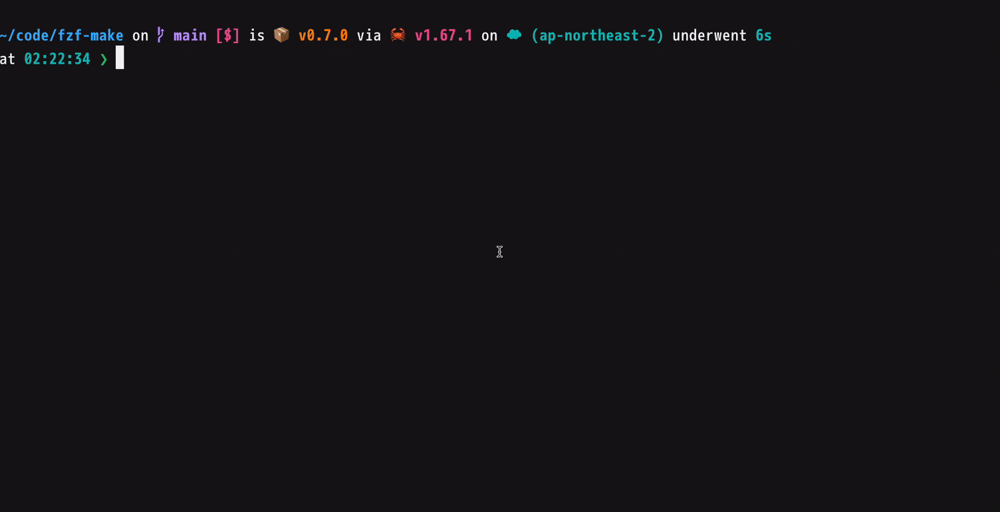

<div align="center">


`fzf-make` is the command line tool that execute make target using fzf.


[](https://github.com/kyu08/fzf-make/releases/latest)



</div>

# 🛠️ Features
- Select and execute a make target using fzf
- Support `include` directive

# 👓 Prerequisites
- [bat](https://github.com/sharkdp/bat) (In the future, we intend to make it work with `cat` as well, but currently it only works with `bat`.)

# 📦 Installation
## Homebrew
```sh
# install
brew tap kyu08/tap
brew install kyu08/tap/fzf-make
```

```sh
# update 
brew update
brew upgrade fzf-make
```

# 💡 Usage
1. Execute `fzf-make` in the directory include makefile(file name should be one of `GNUmakefile`, `makefile`, `Makefile`)
1. Select make command you want to execute

# 👥 Contribution
- Contributions are welcome!
- If you have a Feature request, please create an issue first.
- If you have added fzf-make to some package manager, please let me know. (or please send a PR to add how to install via the package manager in the `README.md`)
- If you have any questions, feel free to create an issue and ask.

# 🗒 Related Article(s)
- (Japanese)[Makefileに定義されたtargetをfzfで選択して実行するCLIツールをRustでつくった](https://blog.kyu08.com/posts/fzf-make)
